# NutriScan AI — System Architecture

```mermaid
flowchart LR
    %% ─────────────────────────────────────────────────────────────────
    %% STYLES
    %% ─────────────────────────────────────────────────────────────────
    classDef input     fill:#1e3a5f,stroke:#3b82f6,color:#e2e8f0,rx:8
    classDef unit1     fill:#14532d,stroke:#10b981,color:#e2e8f0,rx:8
    classDef unit2     fill:#1e3a5f,stroke:#60a5fa,color:#e2e8f0,rx:8
    classDef unit3     fill:#4a1942,stroke:#c084fc,color:#e2e8f0,rx:8
    classDef unit4     fill:#422006,stroke:#fb923c,color:#e2e8f0,rx:8
    classDef unit5     fill:#1e3a5f,stroke:#38bdf8,color:#e2e8f0,rx:8
    classDef unit6     fill:#3b0764,stroke:#a855f7,color:#e2e8f0,rx:8
    classDef output    fill:#1c1917,stroke:#f43f5e,color:#f1f5f9,rx:8
    classDef layer     fill:#0f172a,stroke:#334155,color:#94a3b8,rx:4
    classDef api       fill:#172554,stroke:#3b82f6,color:#bfdbfe,rx:8

    %% ─────────────────────────────────────────────────────────────────
    %% LAYER 0 — INPUT
    %% ─────────────────────────────────────────────────────────────────
    subgraph L0["  📥  INPUT LAYER  "]
        direction TB
        A1["🖼️ Raw Food Image\nJPG / PNG / WEBP"]
        A2["📡 FastAPI Endpoint\nPOST /api/analyze\nmultipart/form-data"]
        A3["🔓 cv2.imdecode\nBGR NumPy Array\nHWC format"]
        A1 --> A2 --> A3
    end

    %% ─────────────────────────────────────────────────────────────────
    %% LAYER 1 — UNIT 6  SVD
    %% ─────────────────────────────────────────────────────────────────
    subgraph L1["  🔢  UNIT 6 · MATRIX DECOMPOSITION  "]
        direction TB
        B1["BGR → Grayscale\ncv2.cvtColor\nfloat32 matrix"]
        B2["SVD Decomposition\nA = U Σ Vᵀ\nnp.linalg.svd"]
        B3["Rank Truncation\nKeep top 85% σ values\nStrip tablecloth / noise"]
        B4["Reconstruct\nà = U Σₖ Vᵀ\nNormalize → uint8"]
        B1 --> B2 --> B3 --> B4
    end

    %% ─────────────────────────────────────────────────────────────────
    %% LAYER 2 — UNIT 1  COLOR SPACES
    %% ─────────────────────────────────────────────────────────────────
    subgraph L2["  🎨  UNIT 1 · COLOR SPACES & PIXEL TOPOLOGY  "]
        direction TB
        C1["BGR → HSV\ncv2.cvtColor\nDecouple chroma / luminance"]
        C2["Channel Split\nH · S · V\ncv2.split"]
        C3["Image Sampling\nLetterbox 640×640\nAspect-ratio padding"]
        C4["Intensity Quantization\nim / 255.0 → \\[0,1\\]\nUniform discrete grid"]
        C1 --> C2
        C3 --> C4
    end

    %% ─────────────────────────────────────────────────────────────────
    %% LAYER 3 — UNIT 2  ENHANCEMENT
    %% ─────────────────────────────────────────────────────────────────
    subgraph L3["  ✨  UNIT 2 · PREPROCESSING & ENHANCEMENT  "]
        direction TB
        D1["CLAHE\nclipLimit=3.0\ntileGrid=(8×8)\nApplied on V channel"]
        D2["Reconstruct BGR\nMerge H·S·V_eq\nHSV → BGR"]
        D3["Gaussian Blur\nkernel=(5×5) σ=0\nLinear — sensor noise"]
        D4["Median Filter\nksize=5\nNonlinear — glare / reflections"]
        D1 --> D2
        D3 --> D4
    end

    %% ─────────────────────────────────────────────────────────────────
    %% LAYER 4 — UNIT 3  SEGMENTATION
    %% ─────────────────────────────────────────────────────────────────
    subgraph L4["  🔬  UNIT 3 · SEGMENTATION & INSTANCE ISOLATION  "]
        direction TB
        E1["Sobel Gradient\nGx = ∂I/∂x  Gy = ∂I/∂y\n|G| = √(Gx²+Gy²)\nksize=3, CV_64F"]
        E2["Otsu Binarization\nAuto threshold T*\nTHRESH_BINARY + THRESH_OTSU"]
        E3["Morphological Close\nEllipse kernel 11×11\n4 iterations — bridge gaps"]
        E4["Distance Transform\nDIST_L2  mask=5\nEuclidean dist to edges"]
        E5["Sure Foreground\nthresh = 0.65 × max(dist)\nStrong peaks only"]
        E6["Sure Background\nDilate morphed\n3 iterations"]
        E7["Unknown Zone\nsubtract(bg, fg)\nBoundary ambiguity"]
        E8["Connected Component\nLabeling — 8-connectivity\ncv2.connectedComponents"]
        E9["Watershed\ncv2.watershed\nTopographic flooding\nMarker-based dams"]
        E10["Region Extraction\nArea filter ≥ 2% image\nContour analysis"]
        E11["Moment Descriptors\nArea A = contourArea\nCentroid cx·cy\nEccentricity ε"]
        E12["Bounding Boxes\ncv2.boundingRect\n\\[x, y, w, h\\]"]
        E13["Instance Merge\nIoU overlap > 60%\nGreedy union merge"]
        E1 --> E2 --> E3 --> E4 --> E5
        E3 --> E6
        E5 --> E7
        E6 --> E7
        E7 --> E8 --> E9 --> E10
        E10 --> E11
        E10 --> E12
        E10 --> E13
    end

    %% ─────────────────────────────────────────────────────────────────
    %% LAYER 5 — UNIT 5  YOLO DETECTION
    %% ─────────────────────────────────────────────────────────────────
    subgraph L5["  🤖  UNIT 5 · DEEP LEARNING DETECTION  "]
        direction TB
        F1["YOLOv5s Backbone\nCSP-Darknet\n214 layers · 7.1M params"]
        F2["Feature Pyramid\nPANet Neck\nMulti-scale fusion\nP3·P4·P5"]
        F3["Detection Head\n3 anchors × 3 scales\n36 food classes\nBbox + Conf + Class"]
        F4["Test-Time Augment\naugment=True\nFlip + Scale ensemble"]
        F5["Non-Max Suppression\nconf ≥ 0.20\nIoU ≤ 0.45\nagnostic=False\nmax_det=100"]
        F6["Scale Boxes\nscale_boxes\nLetterbox → original coords"]
        F1 --> F2 --> F3 --> F4 --> F5 --> F6
    end

    %% ─────────────────────────────────────────────────────────────────
    %% LAYER 6 — UNIT 4  CALORIE LOOKUP
    %% ─────────────────────────────────────────────────────────────────
    subgraph L6["  📊  UNIT 4 · VECTOR QUANTIZATION & CODEBOOK LOOKUP  "]
        direction TB
        G1["Class Label\nnames\\[int(cls)\\]\nString key"]
        G2["Codebook Index Match\n_CALORIE_MAP dict\n36 food classes → kcal"]
        G3["Skip Filter\n_SKIP_CLASSES\nRemove non-food COCO"]
        G4["COCO Remap\n_COCO_REMAP\ncake→Cake/Dessert etc"]
        G5["Calorie Accumulation\ntotal_cals += cals\nper instance"]
        G1 --> G3 --> G4 --> G2 --> G5
    end

    %% ─────────────────────────────────────────────────────────────────
    %% LAYER 7 — OUTPUT
    %% ─────────────────────────────────────────────────────────────────
    subgraph L7["  📤  OUTPUT LAYER  "]
        direction TB
        H1["JSON Response\ndetected_objects\\[\\]\noverall_count\nestimated_calories_total"]
        H2["Canvas Rendering\nBounding boxes\nColored labels\nKcal per item"]
        H3["Results Table\nFood chip · Confidence bar\nCalorie badge · Area px²"]
        H4["Calorie Distribution\nAnimated breakdown bars\nPer-item % of total"]
        H5["Summary Metrics\nItems detected\nTotal kcal animated"]
        H1 --> H2
        H1 --> H3
        H1 --> H4
        H1 --> H5
    end

    %% ─────────────────────────────────────────────────────────────────
    %% MAIN FLOW — LEFT TO RIGHT
    %% ─────────────────────────────────────────────────────────────────
    L0 ==> L1
    L1 ==> L2
    L2 ==> L3
    L3 ==> L4
    L4 -- "watershed_instances\n(bbox · area · eccentricity)" --> L5
    L3 -- "enhanced_bgr\n(letterboxed)" --> L5
    L5 ==> L6
    L6 ==> L7

    %% ─────────────────────────────────────────────────────────────────
    %% APPLY STYLES
    %% ─────────────────────────────────────────────────────────────────
    class A1,A2,A3 input
    class B1,B2,B3,B4 unit6
    class C1,C2,C3,C4 unit1
    class D1,D2,D3,D4 unit2
    class E1,E2,E3,E4,E5,E6,E7,E8,E9,E10,E11,E12,E13 unit3
    class F1,F2,F3,F4,F5,F6 unit5
    class G1,G2,G3,G4,G5 unit4
    class H1,H2,H3,H4,H5 output
```

---

## Layer Legend

| Layer | Unit | Colour | Key Techniques |
|---|---|---|---|
| Input | — | Blue | FastAPI, cv2.imdecode, BGR array |
| Matrix Decomposition | Unit 6 | Purple | SVD, Rank truncation, Reconstruction |
| Color Spaces | Unit 1 | Green | HSV transform, Channel split, Quantization |
| Enhancement | Unit 2 | Blue | CLAHE, Gaussian blur, Median filter |
| Segmentation | Unit 3 | Violet | Sobel, Otsu, Distance transform, Watershed, CCL, Moments |
| Deep Learning | Unit 5 | Cyan | YOLOv5s, PANet, NMS, TTA, BBox scaling |
| Codebook Lookup | Unit 4 | Orange | Calorie map, Class index match, Skip/remap filter |
| Output | — | Red | JSON API, Canvas, Table, Charts |
